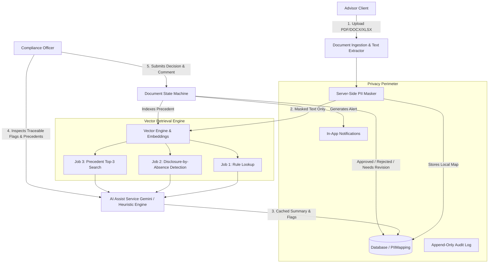

# Compliance Document Review App - Backend

An enterprise-grade, privacy-preserving compliance document review and vector assist backend built with **FastAPI**, **SQLAlchemy**, and **Pydantic**.

This system closes the loop between Financial Advisors and Compliance Officers with strict server-side role boundary enforcement, deterministic server-side PII masking, multi-format text extraction (PDF/DOCX/XLSX), semantic vector search (rule lookup, missing-disclosure detection by absence, precedent retrieval), document revision threading, immutable audit logging, and in-app notifications.

---

## Architecture Overview



---

## Key Capabilities & Core Guarantees

### 1. Strict Role Boundary Enforcement (Server-Side)
- Two fixed roles assigned at sign-up: `advisor` and `officer`.
- Role enforcement happens at the API route dependency layer:
  - Advisors attempting to review/decide documents receive **403 Forbidden**.
  - Officers attempting to upload documents receive **403 Forbidden**.
  - Unauthenticated requests receive **401 Unauthorized**.
  - Advisors are strictly isolated to their own document submissions and revision threads.
  - Compliance Officers have unified queue access across all advisors.

### 2. Deterministic Server-Side PII Masking
- Document text is **never sent to external AI APIs (Gemini/Groq) or hosted embedding models unmasked**.
- Masker detects and replaces:
  - Client & Individual Names (`[CLIENT_1]`, `[CLIENT_2]`)
  - Email Addresses (`[EMAIL_1]`)
  - Phone Numbers (`[PHONE_1]`)
  - Social Security / Tax ID Numbers (`[SSN_1]`)
  - Financial Account & Portfolio Numbers (`[ACCOUNT_1]`)
  - Physical Street & Postal Addresses (`[ADDRESS_1]`)
  - Client-tied Monetary Balances (`[AMOUNT_1]`)
- Mapping table is stored strictly on the server in the `pii_mappings` table.
- Placeholders are deterministic and stable across document sections.
- Verification endpoint `GET /api/v1/documents/{id}/outbound-payload` exposes the exact masked payload to prove zero client PII leaves the app perimeter.

### 3. Vector Similarity & Retrieval Engine
Three distinct retrieval jobs powered by vector embeddings:
1. **Rule Lookup**: Chunks submitted document and retrieves matching compliance rules from SEC/FINRA regulatory standards.
2. **Missing-Disclosure Detection by Absence**: Compares document passages against required mandatory disclosures. If maximum similarity across all chunks is below the tuned threshold (`DISCLOSURE_ABSENCE_THRESHOLD = 0.60`), a missing disclosure flag is automatically generated.
3. **Precedent Search**: Queries the precedent corpus to return the top 3 most similar past reviewed documents, their decisions, and compliance officer commentary.

### 4. AI Compliance Assist & Graceful Degradation
- Summary and traceable flags (passage excerpt, matched rule ID, explanation, severity, suggested fix).
- **The AI NEVER decides**: Final status is recorded only by human Compliance Officers.
- **Graceful Fallback**: If the Gemini API key is absent, rate-limited, or offline, the system seamlessly transitions to local heuristic/vector-backed analysis (`status="degraded"`), ensuring the review queue never gets blocked.

### 5. Document State Machine & Revision Threading
- Supported lifecycle: `pending_review` $\rightarrow$ `approved` | `rejected` | `needs_revision`.
- When an advisor resubmits a document flagged as `needs_revision`:
  - The revision maintains the same `thread_id`.
  - Increments `version_number` ($v1 \rightarrow v2 \rightarrow v3$).
  - Sets `parent_document_id` to form an immutable revision chain.
  - Full thread is retrievable via `GET /api/v1/documents/{id}/thread`.

### 6. Append-Only Audit Trail & In-App Notifications
- Every critical event (`submitted`, `viewed`, `decided`, `resubmitted`, `analysis_generated`, `downloaded`) is logged to `audit_events`.
- In-app notification system alerts advisors immediately upon officer review decisions.

---

## Clean-Checkout Quickstart Guide

### Prerequisites
- Python 3.10+ (Tested on Python 3.10 - 3.14)
- Git

### 1. Clone & Install Dependencies
```bash
# Clone the repository
git clone <repo_url>
cd "glycn bakend"

# Install dependencies
pip install -r requirements.txt
```

### 2. Environment Configuration
Copy `.env.example` to `.env`:
```bash
cp .env.example .env
```
*(Optional: Set your `GEMINI_API_KEY` in `.env` from Google AI Studio. If left blank, the app functions in local deterministic fallback mode).*

### 3. Seed Database with Compliance Rules & 100+ Precedents
```bash
python scripts/seed_corpus.py
python scripts/generate_sample_files.py
```
This initializes:
- Default accounts:
  - **Advisor**: `advisor@example.com` / `Advisor123!`
  - **Compliance Officer**: `officer@example.com` / `Officer123!`
- 25+ regulatory compliance rules and required disclosures.
- 100+ synthetic precedent submissions with decisions and officer feedback.
- Sample PDF, DOCX, and XLSX files in `sample_test_files/`.

### 4. Run the Backend Server
```bash
uvicorn app.main:app --reload --port 8000
```
- API Root: `http://localhost:8000/`
- Interactive OpenAPI Docs (Swagger): `http://localhost:8000/docs`
- ReDoc Docs: `http://localhost:8000/redoc`

---

## Running the Automated Test Suite

The test suite thoroughly verifies role boundaries, PII masking, state machine lifecycle, vector retrieval, audit logs, and offline fallback.

```bash
python -m pytest tests/ -v
```

All 16 test suites pass cleanly out of the box.

---

## API Reference Summary

| Method | Endpoint | Role Guard | Description |
| :--- | :--- | :--- | :--- |
| `POST` | `/api/v1/auth/signup` | Public | Register new user as `advisor` or `officer` |
| `POST` | `/api/v1/auth/login` | Public | Authenticate user and receive JWT bearer token |
| `GET` | `/api/v1/auth/me` | Authenticated | Retrieve authenticated user profile |
| `POST` | `/api/v1/documents/upload` | **Advisor Only** | Upload client-facing document (PDF, DOCX, XLSX $\le$ 10MB) |
| `GET` | `/api/v1/documents` | Authenticated | List documents (Advisor sees own; Officer sees queue) |
| `GET` | `/api/v1/documents/{id}` | Authenticated | Retrieve document details & extracted text (logs view audit) |
| `GET` | `/api/v1/documents/{id}/thread` | Authenticated | Retrieve full revision history for the document thread |
| `POST` | `/api/v1/documents/{id}/revise` | **Advisor Only** | Submit revised file for document in `needs_revision` |
| `GET` | `/api/v1/documents/{id}/download` | Authenticated | Download original uploaded binary file |
| `POST` | `/api/v1/documents/{id}/review` | **Officer Only** | Record review decision (`approved`, `rejected`, `needs_revision`) + comment |
| `GET` | `/api/v1/documents/{id}/assist` | Authenticated | Get cached AI summary, traceable flags & top-3 precedents |
| `POST` | `/api/v1/documents/{id}/assist/retry` | **Officer Only** | Force re-run AI compliance analysis |
| `GET` | `/api/v1/documents/{id}/outbound-payload` | Authenticated | Inspect exact server-side masked payload dispatched to AI |
| `GET` | `/api/v1/documents/{id}/audit` | Authenticated | Retrieve immutable audit trail (`?thread=true` supported) |
| `GET` | `/api/v1/notifications` | Authenticated | Get in-app alerts with unread counter |
| `POST` | `/api/v1/notifications/{id}/read` | Authenticated | Mark individual notification as read |
| `POST` | `/api/v1/notifications/read-all` | Authenticated | Mark all notifications as read |
| `GET` | `/api/v1/corpus/rules` | Authenticated | Query compliance rules and disclosure catalogue |
| `GET` | `/api/v1/corpus/precedents` | Authenticated | Query precedent vector database |

---

## Directory Structure

```text
├── .env.example                    # Template environment variables
├── .env                            # Active environment settings
├── requirements.txt                # Python package dependencies
├── README.md                       # Comprehensive setup and API docs
├── app/
│   ├── main.py                     # FastAPI application setup & lifecycle
│   ├── api/
│   │   ├── deps.py                 # Auth & strict role dependencies (require_advisor, require_officer)
│   │   └── v1/
│   │       ├── auth.py             # Signup and login endpoints
│   │       ├── documents.py        # Upload, list, detail, revise, download endpoints
│   │       ├── reviews.py          # Officer decision & AI assist endpoints
│   │       ├── audit.py            # Audit trail query endpoints
│   │       ├── notifications.py    # In-app notifications endpoints
│   │       ├── corpus.py           # Compliance rules & precedents endpoints
│   │       └── router.py           # Combined API router
│   ├── core/
│   │   ├── config.py               # Pydantic application settings
│   │   ├── database.py             # SQLAlchemy session and engine
│   │   └── security.py             # Password hashing (bcrypt) & JWT tokens
│   ├── models/                     # SQLAlchemy ORM models
│   │   ├── base.py                 # Shared enums and types
│   │   ├── user.py                 # User model (role fixed at sign-up)
│   │   ├── document.py             # Document model (with thread and revision links)
│   │   ├── review.py               # ReviewDecision model
│   │   ├── ai_analysis.py          # AIAnalysis and ComplianceFlag models
│   │   ├── audit.py                # Append-only AuditEvent model
│   │   ├── notification.py         # Notification model
│   │   ├── pii_mapping.py          # Server-side PIIMapping model
│   │   └── vector_corpus.py        # ComplianceRule and PrecedentSubmission models
│   ├── schemas/                    # Pydantic v2 schemas
│   │   ├── user.py
│   │   ├── document.py
│   │   ├── review.py
│   │   ├── ai_analysis.py
│   │   ├── audit.py
│   │   ├── notification.py
│   │   └── vector_corpus.py
│   └── services/                   # Business logic services
│       ├── extractor.py            # PDF, DOCX, XLSX text parser
│       ├── pii_masker.py           # Regex & heuristic PII masking engine
│       ├── vector_engine.py        # Vector embeddings & similarity search
│       ├── ai_assist.py            # Compliance AI generation & graceful fallback
│       ├── document_service.py     # Document lifecycle & revision thread engine
│       ├── audit_service.py        # Immutable audit logger
│       └── notification_service.py # In-app notification dispatcher
├── scripts/
│   ├── seed_corpus.py              # Seeds 25+ rules & 100+ precedents
│   └── generate_sample_files.py    # Generates test PDF, DOCX, and XLSX files
├── sample_test_files/              # Generated test files
└── tests/                          # Automated Pytest suite (16 test suites)
    ├── conftest.py
    ├── test_auth_and_roles.py
    ├── test_pii_masker.py
    ├── test_state_machine.py
    ├── test_vector_retrieval.py
    ├── test_audit_and_notifications.py
    ├── test_graceful_degradation.py
    └── test_extended_coverage.py
```
# -Document-Review-App-Backend

